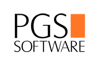

 

# ParallaxView

[](https://swift.org)

## Summary

**Easy to use `UIView`, `UICollectionViewCell` with parallax effect and extensions to add this effect to any `UIView`. Rotate view using Apple TV remote. Works confusingly similar to tiles in the home screen of the Apple TV. Written in Swift.**


## Table of Contents

* [Usage](#usage)
* [Customization](#customization)
* [Requirements](#requirements)
* [Installation](#installation)
* [Author](#author)
* [License](#license)
* [About](#about)

## Usage

To start using the component add it to your project using CocoaPods, Carthage or manually as per the Installation section.

### ParallaxView

To create parallax view intance put `UIView` using *Interface builder* and change its class to `ParallaxView` in *Identity inspector* or do it from code.

### ParallaxCollectionViewCell

In *Interface builder* change collection view cell class to `ParallaxCollectionViewCell` or do it from code.

You can also create subclass of `ParallaxCollectionViewCell` insted of `UICollectionViewCell` and usit is as normal collection view cell.

### Extension

If `ParallaxView` and `ParallaxCollectionViewCell` don't feet to your needs you can use extension that can be used with any `UIView`. In many cases it can look like in this example:
```swift
override func didUpdateFocusInContext(context: UIFocusUpdateContext, withAnimationCoordinator coordinator: UIFocusAnimationCoordinator) {
	coordinator.addCoordinatedAnimations({
		if context.nextFocusedView === yourCustomView {
			yourCustomView.addParallaxMotionEffects()
		}
		if context.previouslyFocusedView === yourCustomView {
			yourCustomView.removeParallaxMotionEffects()
		}
	}, completion: nil)
}
```

It is important to add and remove parallax effect inside the animation block to avoid the glitches.
`ParallaxView` and `ParallaxCollectionViewCell` internally use the same methods.
For more details look into example.

## Customization

The component is documented in code, also look into example for more details.

### Properties

`ParallaxView` and `ParallaxCollectionViewCell` have the same properties for customization.

* `parallaxEffectOptions` - using this property you can customize parallax effect.
	* `parallaxMotionEffect` - configure parallax effect (pan, angles, etc.)
	* `subviewsParallaxMode` - enum that allow you to configure parallax effect for subviews of the `ParallaxView`
	* `shadowPanDeviation` - maximal value of points that shadow of the `ParallaxView` will be moved during parallax effect
	* `glowAlpha` - configure alpha of the glow effect (if is equal to 0.0 then the glow effect will be not added)
	* `glowContainerView` - view that will be used as the container for the glow effect. You don't have to configure this because for `ParallaxView` it will be automatically created a subview for this purpose, while for `ParallaxCollectionViewCell` it will be used `contentView` of the cell. Also by default it is nil when you use extension (`self` will be used as the glow container but only if `glowAlpha` is bigger than 0.0). But if you want to, you can define custom view - look into example project for more details.
* `parallaxViewActions` - use properties of this property to change default behaviours of the parallax view. Internally both `ParallaxView` and `ParallaxCollectionViewCell` calls callbacks.
	* `setupUnfocusedState ` - closure will be called in animation block when view should change its appearance to the focused state
	* `setupFocusedState` - closure will be called in animation block when view should change its appearance to the unfocused state
	* `beforeBecomeFocusedAnimation` - closure will be called before the animation to the focused change start
	* `beforeResignFocusAnimation` - closure will be called before the animation to the unfocused change start
	* `becomeFocused ` - closure will be called when didFocusChange happened. In most cases default implementation should work
   * `resignFocus ` - closure will be called when didFocusChange happened. In most cases default implementation should work.
	* `animatePressIn` - default implementation of the press begin animation
	* `animatePressOut` - default implementation of the press ended animation
* `cornerRadius` - use this value insted of `self.view.layer.cornerRadius`. This will automatically correct radius for glow effect view if it is necessary

## Requirements

Swift 2.2, tvOS 9.0

## Installation

#### CocoaPods

The control is available through [CocoaPods](https://cocoapods.org/). CocoaPods can be installed using [Ruby gems](https://rubygems.org/):
```shell
$ gem install cocoapods
```

Then simply add `ParallaxView` to your Podfile:

```
pod 'ParallaxView', '~> 1.0'
```

Lastly, let CocoaPods fetch the latest version of the component by running:
```shell
$ cocoapods update
```

#### Carthage
The component supports [Carthage](https://github.com/Carthage/Carthage). Start by making sure you have the latest version of Carthage installed. Using [Homebrew](http://brew.sh/) run this:
```shell
$ brew update
$ brew install carthage
```
Then add `ParallaxView` to your `Cartfile`:
```
github "pgs-software/ParallaxView"
```
Finally, add the framework to the Xcode project of your App. Link the framework to your App and copy it to the App’s Frameworks directory via the “Build Phases” section.

#### Manual

You can download the latest files from our [Releases page](https://github.com/pgs-software/ParallaxView/releases). After doing so, drag `ParallaxView.xcodeproj` into your project in Xcode, and for your project target on ***General*** tab in ***Embedded Binaries*** section add `ParallaxView.framework`. Example project is configured the same way, so you have the crib sheet.

## Author

Łukasz Śliwiński and [PGS Software](https://www.pgs-soft.com)

Twitter: [sliwinskilukas](https://twitter.com/sliwinskilukas)
GitHub: [nonameplum](https://github.com/nonameplum)

## License

**ParallaxView** is under MIT license. See [LICENSE](LICENSE) for details.

## About
The project maintained by [PGS Software](https://www.pgs-soft.com). Hire us to design, develop, and grow your product.